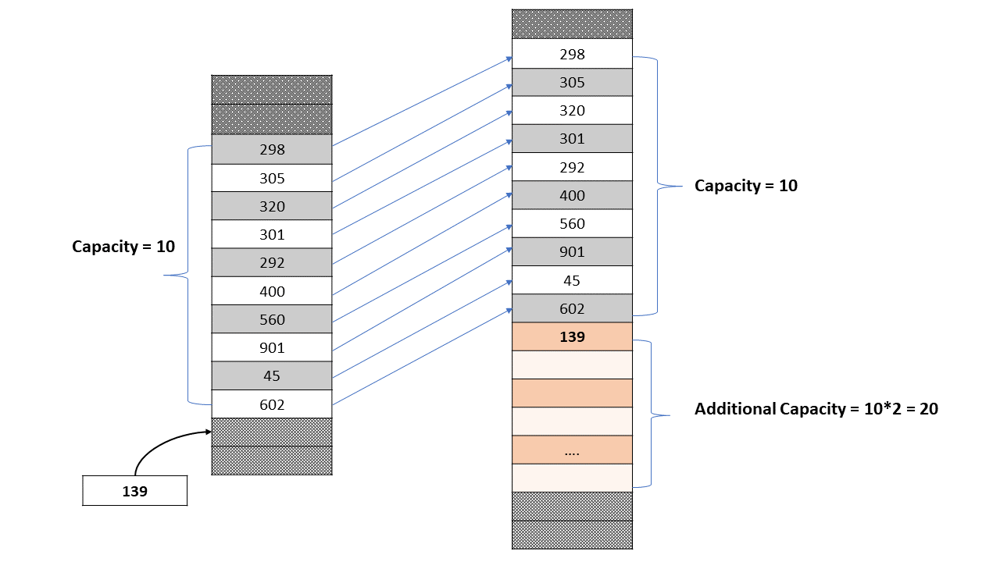

## stack vs python list

The issue with using a list as a stack is that list uses dymanic array internally and when it reaches its capacity it will reallocate a big chunk of memory somewhere else in memory area and copy all the elements. For example in below diagram if a list has a capacity of 10 and we try to insert 11th element, it will not allocate new memory in a different memory region, copy all 10 elements and then insert the 11th element. So overhead here is (1) allocate new memory plus (2) copy all existing elements in new memory area

